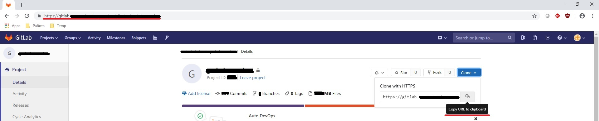
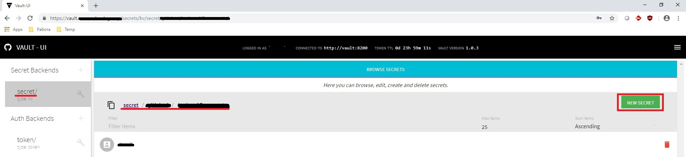
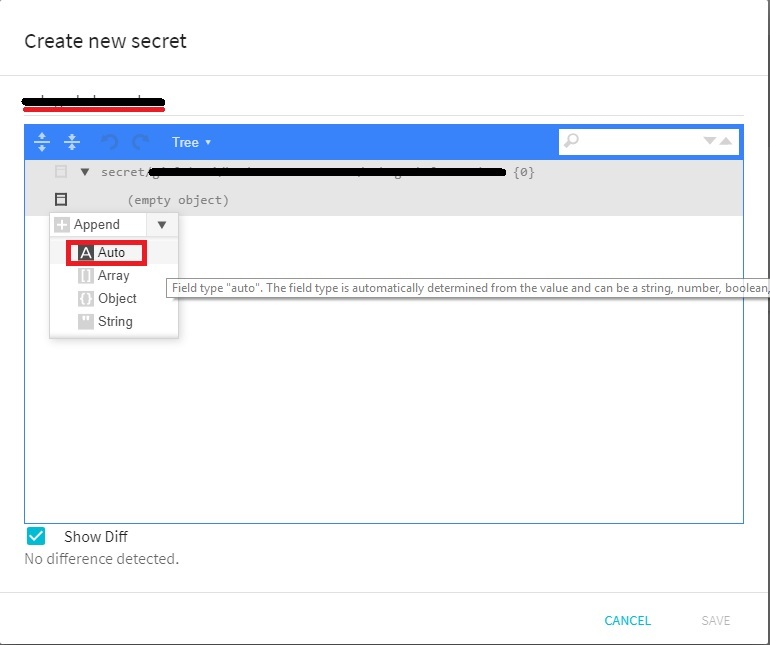
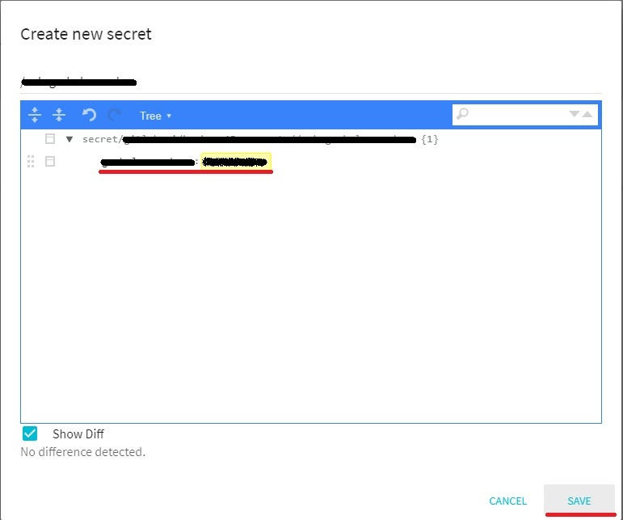
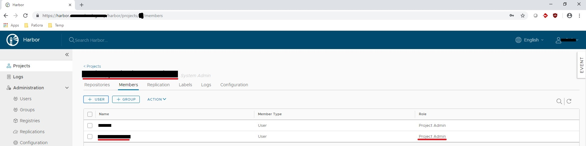
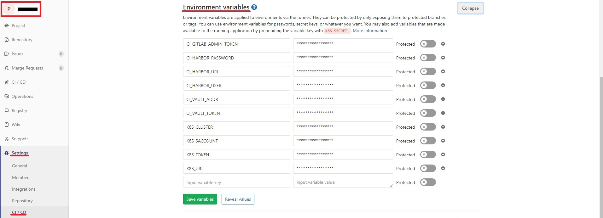
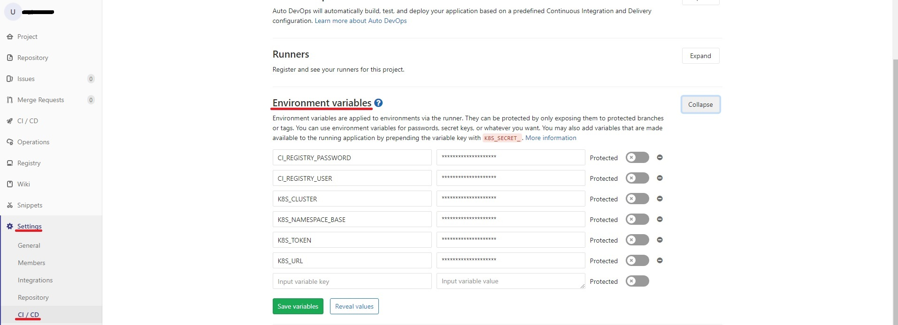
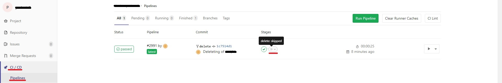
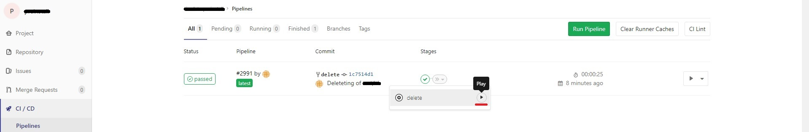

# Pipeline создания namespaces, лимитов потребления ресурсов, необходимых секретов и сопостовления ролей для разворачивания контейнеризованных приложений проектов разработки  

**Принятые соглашения и предварительная подготовка:**  

  1. Исходные данные определяются переменными (описание ниже), в качестве URL-адреса проекта можно указать ссылку на клонирование репозитория:  

  

  2. Уникальным идентификатором проекта Gitlab примем считать полный путь к проекту в Gitlab (группа/подгруппа/.../проект), сокращенный до первых символов названия группы и подгрупп, разделенных дефисом, с полным именем пректа. Идентификатор преобразуется к буквенно-цифровым символам в нижнем регистре, все прочие символы заменяются дефисом (именование namespaces Kubernetes имеет ограничения на используемые символы).  

  Пример:  
  - URL проета - _<https://gitlab.example.com/group/subgroup/example.project.git>_  
  - Идентификатор - ***g-s-example-project***  
  3. Для доступа к Harbor Registry из конвейера Gitlab и пространств имен Kubernetes, необходимо создать сервисную учетную запись в Active Directory с ограниченными правами (guest).  
    **`ВАЖНО: Имя пользователя не должно превышать 20 символов!`**  

  4. Перед выполнением сценария определения переменных окружения CI/CD проектов разработки и создания, необходимых для деплоя приложений, объектов в Kubernetes, учетная запись должна быть сохранена в хранилище секретов Vault по пути: *secret/path/*.  
    **`ВАЖНО: Имя секрета должно совпадать с идентификатором проекта Gitlab!`**  

  Пример получения идентификатора:  
```
export PROJECT_URL="https://gitlab.example.com/group/subgroup/example.project.git"
echo $PROJECT_URL | sed -r 's:(.*)(.git)$:\1:' | sed -r 's:^([^/]*/){3}::' | sed -r 's:([a-zA-Z0-9])[^/]*/:\1-:g' | sed 's/[^a-zA-Z0-9]/-/g' | awk '{print tolower($0)}'
g-s-example-project  
```
    
  Примеры сохранения секрета в Vault CLI и web UI (настроена LDAP аутентификация):  
```
export VAULT_TOKEN="<токен роли harbor-accounts-admin>"
export VAULT_ADDR="https://vaultapi.example.com"
vault kv put secret/path/g-s-example-project <username>=<password>  
```





  5. Проект в Harbor (настроена LDAP аутентификация) создется с именем, равным идентификатору проекта Gitlab, сервисная учетная запись AD добавляется в проект Harbor с ролью "Project Admin" (при выполнении **preinstall pipeline**).  

  

  6. Имя namespace Kubernetes создается в **preinstall pipeline** по следующим правилам -  `<идентификатор проекта Gitlab>-dev` для dev окружения и `<идентификатор проекта Gitlab>-test` - окружения test. Для каждого окружения будут определены свои лимиты.  
  7. В качестве job Docker executors Gitlab по умолчанию, используется образ centos.  

_Таким образом, в рамках pipeline проекта разработки, доступ к Registry ограничен только соответсвующим проектом Harbor, доступ к кластеру Kubernetes - только выделенными пространствами имен._  

## Описание проекта preinstall  
Проект предназначен для установки переменных окружения CI/CD проектов разработки, подготовки Kubernetes для деплоя приложений в pipeline проектов разработки. Pipeline данного проекта выполняется при пуше изменений в ветку master или delete репозитория проекта.  

Переменные окружения CI/CD:  
  - `CI_GITLAB_ADMIN_TOKEN` - токен сервисной учетной записи Gitlab с правами администратора.  
  - `CI_VAULT_ADDR` - URL хранилища секретов VAULT (<https://vaultapi.example.com>).  
  - `CI_VAULT_TOKEN` - токен учетной записи с правами администратора объектов ветки secret/path. Время жизни (TTL) токена 768 часов, в pipeline настроено обновление TTL при каждом использовании.  
  - `CI_HARBOR_URL` - URL Registry Harbor (<https://harbor.example.com>).  
  - `CI_HARBOR_USER` - имя локального пользователя Harbor с правами администратора - admin.  
  - `CI_HARBOR_PASSWORD` - пароль пользователя admin.  
  - `K8S_URL` - URL кластера Kubernetes (<https://k8s.example.com:port>).  
  - `K8S_SACCOUNT` - имя учетной записи Kubernetes с правами администратора (ClusterRole cluster-admin).  
  - `K8S_TOKEN` - токен учетной записи с правами администратора. Команда для получения:  
    ```
    kubectl -o json get secret $(kubectl get serviceaccounts <account> -o json -n kube-system | jq -r '.secrets[0].name') -n kube-system | jq -r '.data."token"' | base64 -d - ; echo
    ```
  - `K8S_CLUSTER` - имя кластера Kubernetes.  
    

Переменные окружения, определяемые в файле *.ci_env*, прокомментированы в самом файле. Меняется переменная `PROJECT_URL` для каждого нового проекта.  

Переменные Helm определены и прокомментированы в файле *values.yaml*. Устанавливают, помимо прочего, квоты и лимиты использования ресурсов Kubernetes.  

Описание конвейера дано в коментариях кода pipeline, файл *.gitlab-ci.yml*.  

В результате выполнения pipeline будт заданны переменные окружения CI/CD проекта разработки, созданны объекты в кластере Kubernetes: namespaces проекта, сервисный аккаунт с привязкой к роли, квоты и лимиты на ресурсы.  

Описание переменных окружения CI/CD проекта разработки:  
  - `CI_REGISTRY_USER` - имя администратора проекта Harbor.  
  - `CI_REGISTRY_PASSWORD` - пароль администратора проекта Harbor.  
  - `K8S_URL` - URL кластера Kubernetes (<https://k8s.example.com:port>).  
  - `K8S_TOKEN` - токен учетной записи, роль определяется в *values.yaml*.  
  - `K8S_CLUSTER` - имя кластера Kubernetes.  
  - `K8S_NAMESPACE_BASE` - базовый namespace, равный идентификатору проекта разработки.  

    

Все, сделанные, настройки CI/CD проекта разработки можно удалить. Для этого необходимо определить `PROJECT_URL` нужного проекта, запушить изменения в ветку delete и вручную запустить выполненеие job-а "delete".  
    **`ВАЖНО: Будут удалены все объекты, развернутые в Kubernetes, во всех namespaces проекта разработки, будет удален проект в Harbor! Для продуктового окружния будет реализована другая логика впоследствии, скорее всего, на выделенном кластере.`**

Пример удаления подготовленной среды CI/CD проекта <https://gitlab.example.com/group/subgroup/example.project>:  
  - установить переменную `PROJECT_URL`;  
  - выполнить команды:  
```
git checkout -b delete
git add .
git commit -m "Deleteting of group/subgroup/example.project"
git push --set-upstream origin delete
git checkout master
git merge delete
```
  - запустить выполненеие job, как на скриншотах ниже:

  
  

Команды просмотра и удаления списка pipeline (удаляются вместе с jobs, артефактами и трассировкой). За один проход выводит или удаляет только первую страницу, необходимо повторить несколько раз, если список больше одной страницы:  
```
curl -s --header "PRIVATE-TOKEN: <access_token>" 'https://gitlab.example.com/api/v4/projects/<project_ID>/pipelines/' | jq . | grep '"id": ' | sed 's/[^0-9]//g'
curl -s --header "PRIVATE-TOKEN: <access_token>" 'https://gitlab.example.com/api/v4/projects/<project_ID>/pipelines/' | jq . | grep '"id": ' | sed 's/[^0-9]//g' | while read line; do curl --request "DELETE" --header "PRIVATE-TOKEN: <access_token>" https://gitlab.example.com/api/v4/projects/<project_ID>/pipelines/$line; done
```
